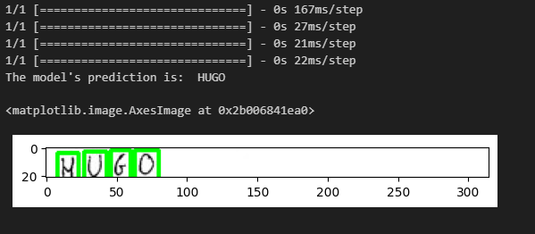
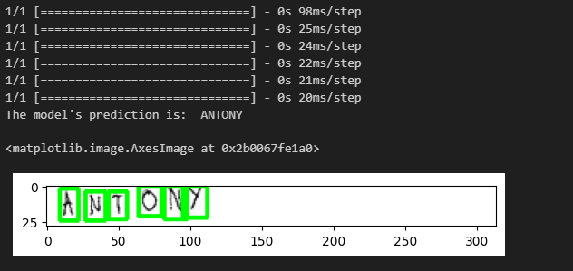
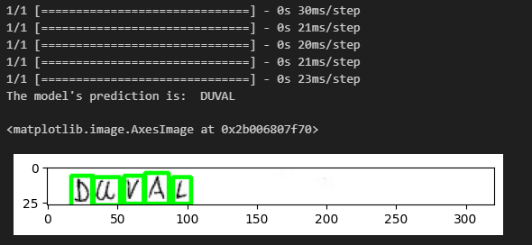

# Handwriting Recognition Project

## Project Overview
This project focuses on developing a machine learning model capable of recognizing and classifying handwritten characters. 

## Technologies Used
- Python
- Libraries: NumPy, Pandas, OpenCV, Matplotlib, TensorFlow, Keras

## Workflow
- Data Import: The dataset is imported using Pandas. The dataset includes a balanced mix of handwritten characters.
- Data Processing: The data is then concatenated, processed, and prepared for training.
- Model Building: A convolutional neural network (CNN) is used for this classification task, leveraging TensorFlow and Keras.
- Training & Validation: The model is trained and validated with the [EMNIST dataset.](#datasets)
- Testing: The model is tested with [Handwriting Recognition dataset.](#datasets)

## Performance Metrics
- Best validation loss achieved: 0.12173
- Best validation accuracy achieved: 96.2%

## Datasets
- Training and validation dataset: [EMNIST Balanced Dataset (Capital Letters Only).](https://www.kaggle.com/datasets/crawford/emnist)
- Test dataset: [Handwriting Recognition Dataset.](https://www.kaggle.com/datasets/landlord/handwriting-recognition)

## Test Results
### Tested on first 1001 samples
- Correct character predictions: 84.020%
- Correct word predictions: 55.228%

### Visualization of results

## Potential Improvements
- The testing dataset contains a lot of images with redundant letters, cursive words, incorrect labels. 
Therefore, the correct preprocessing should vastly increase the testing accuracy.
